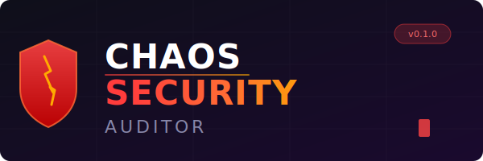

<p align="center">
  
</p>

<p align="center">
  <strong>AI-driven adversarial security testing in sandboxed environments</strong>
</p>

<p align="center">
  <a href="#quickstart">Quickstart</a> &middot;
  <a href="docs/architecture.md">Architecture</a> &middot;
  <a href="docs/phases.md">Phases</a> &middot;
  <a href="docs/vectors/">Vector Catalog</a>
</p>

---

## What is CSA?

**Chaos Security Auditor** combines chaos engineering principles with automated penetration testing. It maps a target's attack surface, generates prioritized attack vectors, and executes them inside isolated Docker sandboxes — producing a structured Chaos Report with findings, evidence, and remediation guidance.

All testing runs in **fully isolated containers** with no host or internet access. The framework is designed for authorized security testing, red-team exercises, and CI/CD security validation.

## Architecture

```
┌─────────────────────────────────────────────────────┐
│                   CSA CLI (Click)                    │
├──────────┬──────────────┬───────────┬───────────────┤
│  Recon   │   Vectors    │  Engine   │   Reporting   │
│          │              │           │               │
│ • Repo   │ • Application│ • Execute │ • Markdown    │
│   Mapper │ • Middleware │   Loop    │   Reports     │
│ • Surface│ • Infra      │ • Schedule│ • Jinja2      │
│   Analyze│              │   & Rank  │   Templates   │
│ • Dep    │              │           │               │
│   Audit  │              │           │               │
├──────────┴──────────────┴───────────┴───────────────┤
│              Docker Sandbox (Isolated)               │
│  ┌─────────┐   ┌──────────┐   ┌──────────────────┐ │
│  │   CSA   │◄─►│  Target  │◄─►│    Defender       │ │
│  │ Runner  │   │  Service │   │  (Log + Respond)  │ │
│  └─────────┘   └──────────┘   └──────────────────┘ │
└─────────────────────────────────────────────────────┘
```

## Phases

| Phase | Name | Description |
|-------|------|-------------|
| 1 | **Contextual Reconnaissance** | Clone repo, detect tech stack, map endpoints, audit dependencies for known CVEs |
| 2 | **Attack Vector Generation** | Generate application-, middleware-, and infrastructure-level attack vectors |
| 3 | **Execution Loop** | Hypothesize &rarr; Attack &rarr; Observe &rarr; Escalate with adaptive scheduling |

See [docs/phases.md](docs/phases.md) for detailed breakdowns.

## Attack Vector Coverage

| Level | Techniques | Reference |
|-------|-----------|-----------|
| **Application** | BOLA/IDOR, injection (SQL, NoSQL, command, SSTI), business-logic flaws, auth bypass | [Catalog](docs/vectors/application.md) |
| **Middleware** | Broker ACL bypass, cache poisoning, storage misconfiguration, request smuggling | [Catalog](docs/vectors/middleware.md) |
| **Infrastructure** | Container escape, Dockerfile audit, resource exhaustion, orchestration flaws | [Catalog](docs/vectors/infrastructure.md) |

## Quickstart

### Install locally

```bash
pip install -e ".[dev]"
csa --help
```

### Run with Docker (sandboxed)

```bash
docker compose up
```

### Run reconnaissance

```bash
csa recon --repo https://github.com/your-org/target-app
```

### Generate report

```bash
csa report -o reports/chaos_report.md
```

## Project Structure

```
chaos_auditor/
├── cli.py                    # CLI entry point (Click)
├── config.py                 # YAML/TOML config loader
├── recon/                    # Phase 1: Contextual Reconnaissance
│   ├── repo_mapper.py        #   Clone & detect tech stack
│   ├── surface_analyzer.py   #   Map endpoints, webhooks, schemas
│   └── dependency_audit.py   #   Scan manifests for CVEs
├── vectors/                  # Phase 2: Attack Vector Generation
│   ├── application.py        #   BOLA, injection, logic flaws
│   ├── middleware.py          #   Broker, cache, storage audits
│   └── infrastructure.py     #   Container, Dockerfile, resources
├── engine/                   # Phase 3: Execution Loop
│   ├── executor.py           #   H→A→O→E cycle
│   └── scheduler.py          #   Vector prioritization
├── reporting/                # Chaos Report output
│   ├── report.py             #   Report model & generator
│   └── templates/            #   Jinja2 markdown templates
└── defender/                 # Defender integration
    └── monitor.py            #   Log watcher & response tracker
```

## Safety & Governance

- All tests execute inside **isolated Docker containers** with `internal: true` networking — no host or internet access.
- The framework requires **explicit opt-in** via signed configuration before any active testing.
- Attack vectors are derived from **public vulnerability databases** (OWASP, CWE, NVD).
- All findings are logged with full provenance for audit trails.
- The defender module provides **real-time monitoring** and can halt tests that exceed defined thresholds.

## Development

```bash
# Install dev dependencies
pip install -e ".[dev]"

# Run tests
pytest

# Lint
ruff check chaos_auditor/ tests/

# Type check
mypy chaos_auditor/
```

## License

MIT
