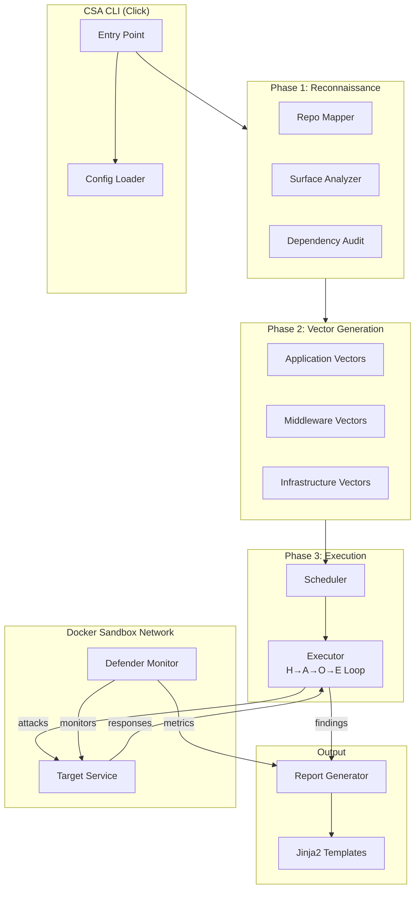
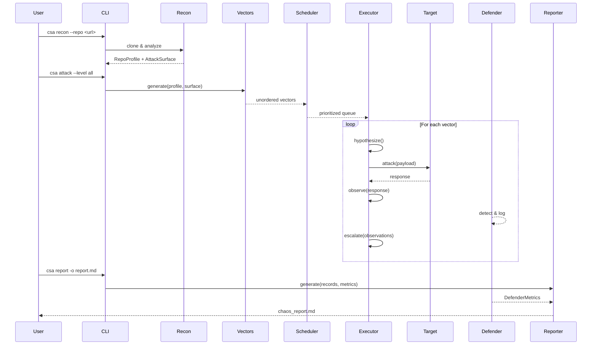

# System Architecture

## Overview

The Chaos Security Auditor (CSA) is structured as a modular CLI framework with four core subsystems orchestrated inside Docker-based sandboxes.

## Component Diagram

## Data Flow

## Key Design Decisions

| Decision | Rationale |
|----------|-----------|
| Click-based CLI | Composable sub-commands, rich help text, easy testing |
| Docker isolation | All active testing runs in sandboxed containers with no host access |
| Internal bridge network | `internal: true` prevents sandbox containers from reaching the internet |
| Jinja2 reporting | Flexible template-based output; supports Markdown, HTML, JSON |
| Dataclass models | Immutable, typed data structures for passing findings between phases |
